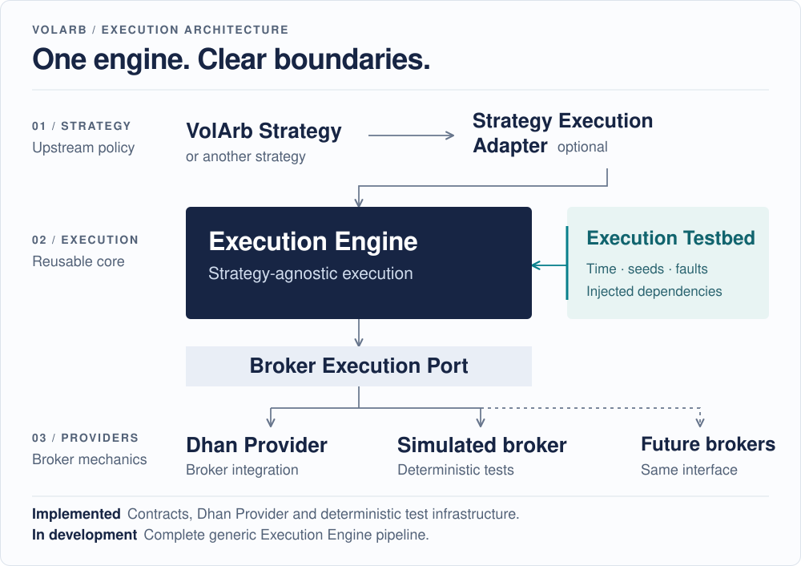

# Volarb

**Quantitative research. Broker-neutral execution. Deterministic testing.**

Volarb brings Indian index-option research and strategy workflows together with reusable execution infrastructure. It separates the decision to trade from execution policy and broker mechanics, so research, simulation and provider integration can evolve independently.

[](https://github.com/ayyararyan/volarb/actions/workflows/architecture-identity.yml)
[](https://github.com/ayyararyan/volarb/actions/workflows/execution-testbed.yml)
[](https://github.com/ayyararyan/volarb/actions/workflows/test-dhan-mcp.yml)

[Architecture](#architecture) · [Start here](#start-here) · [Development](#local-development) · [Repository map](docs/REPOSITORY_MAP.md)

<picture>
  <source media="(max-width: 600px)" srcset="docs/assets/volarb-architecture-mobile.svg">
  
</picture>

**Current scope:** broker contracts, the Dhan Provider, deterministic test infrastructure and research tooling are implemented. The complete generic Execution Engine is **under development**, not a deployed autonomous trading system.

## Capabilities and status

| Area | Available today | Implementation boundary |
|---|---|---|
| **Execution infrastructure** | Provider-neutral ports, global Provider Error Envelope, immutable component identities and validated composition bindings | Policy/convergence pipeline and production environment loader are designed, not yet implemented |
| **Dhan integration** | REST/WebSocket connector; normalized commands, queries and streams; instrument translation and readiness gates | Mechanical broker operations, not strategy or execution policy |
| **Deterministic testing** | Virtual clock, seeded scenarios, simulated broker/market, faults, traces, invariants and composition harnesses | Exercises implemented components and fixtures; full-engine coverage awaits the engine |
| **Quantitative research** | Option-surface analytics, physical realized-volatility forecasting, event/news filtering and butterfly decision workflows | Decision support and experimental research, not order authority |
| **Research laboratory** | Offline experiments, isolated workers, dataset provenance and evidence grading | Separate scientific baseline; not the live decision controller |

The [SHADOW day-workflow prototype](services/day-workflow/README.md) and optional [eSSVI/IV/HAR dashboard](services/essvi-dashboard/README.md) are supporting services. Their deployment-specific dependencies are documented separately.

## Architecture

The canonical boundary is **Strategy → optional Strategy Execution Adapter → Execution Engine → Broker Execution Port → Broker Provider**.

The Execution Engine is reusable and strategy-agnostic: **`component.execution_engine`**, with immutable VID namespace **`[5,0,...]`**. Volarb's position/strategy layer owns instrument intent, butterfly semantics and risk decisions. Dhan translates, transmits and normalizes broker facts; it does not choose execution policy.

The **designed** execution path is:

```text
Margin Optimization → Execution Slicing → Optimal Execution
    → Execution Recovery / Command Commit Guard → Broker Execution Port
```

**State Integrity, Execution Recovery and Interrupt Control** span that path. The former `component.internal_execution` name is a compatibility alias only.

See the [architecture index](architecture/README.md) for identities and composition, and the [Execution Engine design](docs/workflows/execution-engine.md) for policy and recovery semantics.

### One engine, injected environments

The testing model requires **the same engine code**, with dependencies supplied through ports—not a second engine or test-only policy branches.

| Dependency | Deterministic test environment | Production target |
|---|---|---|
| Broker | Simulated broker | Dhan Provider |
| Time and market | Virtual clock, simulated observations | Real clock, live observations |
| Failure conditions | Seeded faults and recorded traces | Normalized provider errors and reconciliation |

The five intended levels are **box tests → composition tests → full-engine scenarios → mass simulation → replay/shadow**. Box/composition harnesses and scenario/mass drivers exist; complete-engine mounting and dedicated replay/shadow runners remain planned. Environment manifests are declarations, not an executable loader.

[Execution Testbed](docs/testing/execution-testbed.md) · [Environment definitions](environments/execution/README.md)

## Start here

Choose a path by the work you want to do. The [full repository map](docs/REPOSITORY_MAP.md) covers secondary services, tooling and historical records.

| Work on | Canonical entrypoint |
|---|---|
| Architecture and identities | [`architecture/`](architecture/README.md) — manifests, registries, composition and validation |
| Generic execution | [`execution-engine/`](execution-engine/README.md) — implemented contracts and the runtime boundary |
| Execution testing | [`execution-testkit/`](execution-testkit/README.md) and [`environments/execution/`](environments/execution/README.md) |
| Broker integration | [`services/dhan-chatgpt-mcp/`](services/dhan-chatgpt-mcp/README.md) — Dhan Provider and service interfaces |
| Volarb strategy | [Strategy composition/design](docs/autonomous-butterfly-workflow.md); [current operating algorithm](docs/DAILY_OPERATING_ALGORITHM.md) |
| Research and decision modules | [`skill/`](skill/README.md) — butterfly outlook, realized volatility and market news |
| Offline experiments | [`agent/`](agent/README.md) — Butterfly Research Laboratory |
| Source/workspace packaging | [`agent-kit/`](agent-kit/README.md) — distinct from the research laboratory |
| Operations and documentation | [`docs/`](docs/README.md) and [`prompts/`](prompts/README.md) — canonical procedures and bounded prompts |
| Historical generations | [`archive/`](archive/README.md) — superseded designs and reports, not operational instructions |

## Local development

Start with **offline source validation**. No broker credentials or running services are required. Use the repository pins: **Node 26.5.0**, **npm 11.17.0** and **Python 3.12.13**. Run from the repository root:

```sh
# Architecture and deterministic Execution Testbed: no npm install required.
node architecture/validate.mjs
node --test architecture/lib/*.test.mjs architecture/*.test.mjs \
  execution-testkit/test/*.test.mjs

# Locked provider dependencies and synthetic tests.
npm ci --ignore-scripts --prefix services/dhan-chatgpt-mcp
npm test --prefix services/dhan-chatgpt-mcp

# Local documentation paths, anchors, JSON and JavaScript imports.
python3.12 -B tools/check_repository.py
```

For Python regression suites, isolated environments, research-lab checks, skill packages and container builds, follow the [validation guide](docs/VALIDATION.md). The laboratory has its own dependency lock; do not merge it with the root kit environment. The [portable kit guide](docs/AGENT_KIT.md) covers installation without restoring private runtime state.

### Production boundary

Repository code and passing CI do not activate trading or establish live broker readiness. Credentials and account state stay private; test, replay, shadow and production dependencies are separate. **Production must never depend on `execution-testkit`.** Live mutations require explicit production configuration, broker readiness and operating authorization; they are not a quickstart step.

The current strategy workflow remains human-executed under the [adopted covenant](docs/PERSONAL_BUTTERFLY_TRADING_GOVERNANCE.md). Historical journals are not live account truth. Publishing source does not deploy services or refresh installed skills.

### Development conventions

- Preserve canonical VIDs and compatibility aliases; never renumber existing identities.
- Keep strategy semantics and provider-native logic outside the generic engine.
- Inject runtime dependencies; do not add test-only branches to production execution policy.
- Update canonical documentation with code, and run the affected suites plus architecture validation.

Component/package versions are independently scoped; there is no repository-wide release version. Follow [development history](docs/DEVELOPMENT_HISTORY.md) for milestones and [open implementation work](tasks.md) for what remains.
