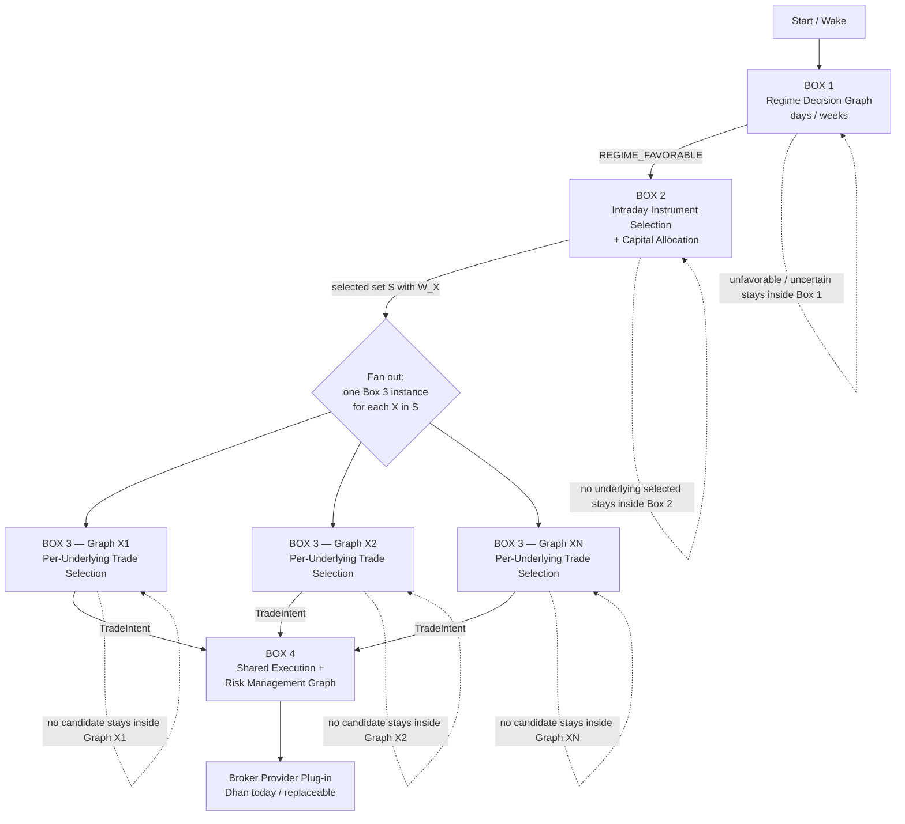

# Autonomous Butterfly Trading Workflow — Master Graph v0.7

This file is the **top-level orchestration graph** for the autonomous Volarb butterfly trading system.

Detailed decision logic no longer lives here. Each major box owns its own graph so that the system can grow without turning the master workflow into an unreadable diagram.

## Master graph



## The four boxes

### Box 1 — Regime Decision Graph

**Horizon:** days / weeks.

Question:

> Is the broader market regime currently favorable for short-gamma deployment?

If unfavorable or uncertain, Box 1 owns the multi-day waiting/recheck loop. Only a favorable decision hands control to Box 2.

Detailed graph: [workflows/01-regime-decision.md](workflows/01-regime-decision.md)

---

### Box 2 — Intraday Instrument Selection & Capital Allocation

**Horizon:** intraday.

Question:

> Given a favorable regime, which of NIFTY, BANKNIFTY, and SENSEX should be committed for today, and how much capital W_X should each receive?

If no underlying is selected, Box 2 owns the intraday opportunity-recheck loop.

If a non-empty set `S` is selected, Box 2 creates a durable daily commitment and reserves `W_X` for every selected X, then launches one Box 3 instance per underlying.

Detailed graph: [workflows/02-intraday-selection.md](workflows/02-intraday-selection.md)

---

### Box 3 — Per-Underlying Trade Selection Graph X

**Horizon:** within the hour once X has been selected.

One independent instance is launched for every selected underlying.

Question:

> Given that X is already committed for today and W_X is reserved, which admissible structure should be traded?

Graph X builds `C_X`, runs its constrained optimizer, and either:

- finds a `StructureSpec` and emits a `TradeIntent` to Box 4; or
- finds no acceptable structure and remains active, with `W_X` reserved, while its within-hour scheduler determines when to search again.

Detailed graph: [workflows/03-per-underlying-graph.md](workflows/03-per-underlying-graph.md)

---

### Box 4 — Shared Execution & Risk Management Graph

**Horizon:** live trading / position lifecycle for the day.

This box is common to all active Graph X instances.

Question:

> Given an approved TradeIntent, how should Volarb establish, supervise, manage, modify, and eventually close the position?

Volarb owns the intelligence. A thin broker provider plug-in performs broker-specific transport and returns authoritative facts.

Before live execution, Box 4 queries broker-specific margin feasibility through the broker-neutral `BrokerMarginFeasibilityPort`.

Detailed graph: [workflows/04-execution-risk.md](workflows/04-execution-risk.md)

## Scheduling hierarchy

The three waiting/re-evaluation clocks now belong to different boxes:

```text
BOX 1 — DAYS / WEEKS
Regime unfavorable or uncertain
    -> Regime Recheck Scheduler
    -> regime decision again

BOX 2 — INTRADAY
Regime favorable but selected set S is empty
    -> Intraday Opportunity Recheck Scheduler
    -> instrument selection again

BOX 3 — WITHIN THE HOUR
Underlying X already committed but no acceptable C_X candidate
    -> Within-Hour Structure Recheck Scheduler
    -> structure search / optimizer again
```

## Cross-box contracts

```text
Box 1 -> Box 2
  REGIME_FAVORABLE

Box 2 -> Box 3(X)
  DailyUnderlyingCommitment
    underlying = X
    reserved capital = W_X

Box 3(X) -> Box 4
  broker-neutral StructureSpec / TradeIntent

Box 4 <-> Broker Provider Plug-in
  MarginFeasibility
  execution commands
  fills / status / errors / positions / account state
```

## Global architectural rules already established

- Dhan is an infrastructure provider, not part of the core strategy architecture.
- Research-data ingestion, decision-time market data, margin/account facts, and execution transport must cross broker/provider-neutral interfaces.
- The broker supplies authoritative facts; Volarb supplies trading intelligence.
- A favorable regime does not force an underlying selection.
- Selecting an underlying does not force an immediate structure.
- Once X is selected for the day, its `W_X` is reserved until an explicit higher-level revocation or end-of-day expiry rule says otherwise.
- Failure to find a structure does not revoke the underlying commitment.
- Parallel Graph X instances cannot double-count shared capital.
- The per-underlying optimizer may return no feasible/attractive candidate.
- Selecting a `StructureSpec` ends the trade-selection decision for that opportunity and hands it to Box 4.
- The broker executor must not independently alter strategy decisions.
- Broker-derived margin feasibility is a legitimate required input before execution.
- The conditions that revoke a daily underlying commitment remain intentionally unresolved.

## Detailed graph index

1. [Box 1 — Regime Decision](workflows/01-regime-decision.md)
2. [Box 2 — Intraday Instrument Selection & Capital Allocation](workflows/02-intraday-selection.md)
3. [Box 3 — Per-Underlying Trade Selection](workflows/03-per-underlying-graph.md)
4. [Box 4 — Shared Execution & Risk Management](workflows/04-execution-risk.md)

## Future evolution

The master graph should remain small. New detail belongs inside the appropriate box unless it represents a genuinely new top-level phase of the system.

The next major work is to open these boxes one at a time and design their internal logic without changing the other boxes' responsibilities unless new evidence requires it.
