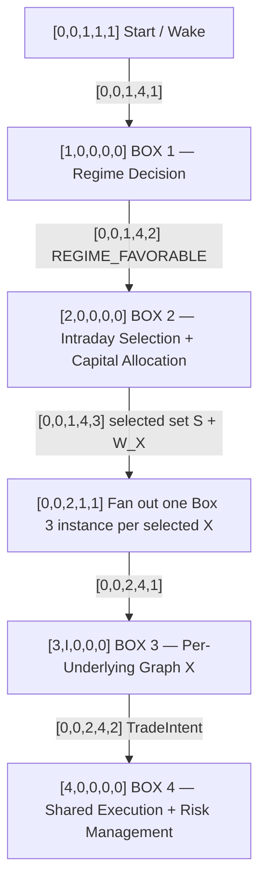

# Autonomous Butterfly Trading Workflow — Master Graph v0.8

**Master VID:** `[0,0,0,0,0]`

This is the top-level orchestration graph. Every structural entity uses the Volarb Vector Identity System:

`VID = [Box, Instance, Layer, Type, Ordinal]`

Specification: [workflows/vector-id-system.md](workflows/vector-id-system.md)  
Registry: [workflows/vector-id-registry.json](workflows/vector-id-registry.json)

## Master graph



For Box 3 runtime instances:

- `I=1` NIFTY
- `I=2` BANKNIFTY
- `I=3` SENSEX

## The four boxes

### [1,0,0,0,0] Box 1 — Regime Decision Graph

**Horizon:** days / weeks.

Question: Is the broader market regime currently favorable for short-gamma deployment?

If unfavorable or uncertain, Box 1 owns the multi-day waiting/recheck loop. Only a favorable decision hands control to Box 2.

Detailed graph: [workflows/01-regime-decision.md](workflows/01-regime-decision.md)

### [2,0,0,0,0] Box 2 — Intraday Instrument Selection & Capital Allocation

**Horizon:** intraday.

Question: Given a favorable regime, which of NIFTY, BANKNIFTY, and SENSEX should be committed for today, and how much capital `W_X` should each receive?

If no underlying is selected, Box 2 owns the intraday opportunity-recheck loop. A non-empty set `S` creates durable daily commitments and reserved `W_X`, then launches Box 3 instances.

Detailed graph: [workflows/02-intraday-selection.md](workflows/02-intraday-selection.md)

### [3,0,0,0,0] Box 3 — Per-Underlying Trade Selection Template

**Horizon:** within the hour once X has been selected.

One independent instance is launched for every selected underlying.

Question: Given that X is already committed for today and `W_X` is reserved, which admissible structure should be traded?

A selected `StructureSpec` becomes a broker-neutral `TradeIntent` for Box 4. No acceptable structure keeps Graph X active with `W_X` reserved and triggers the within-hour scheduler.

Detailed graph: [workflows/03-per-underlying-graph.md](workflows/03-per-underlying-graph.md)

### [4,0,0,0,0] Box 4 — Shared Execution & Risk Management Graph

**Horizon:** live trading / position lifecycle for the day.

This box is common to all active Box 3 instances.

Question: Given an approved `TradeIntent`, how should Volarb establish, supervise, manage, modify, and eventually close the position?

Volarb owns the intelligence. Thin replaceable broker adapters provide execution transport and authoritative broker facts, including margin feasibility.

Detailed graph: [workflows/04-execution-risk.md](workflows/04-execution-risk.md)

## Scheduling hierarchy

```text
[1,0,5,3,1] DAYS / WEEKS
Regime Recheck Scheduler

[2,0,7,3,1] INTRADAY
Intraday Opportunity Recheck Scheduler

[3,I,7,3,1] WITHIN THE HOUR
Within-Hour Structure Recheck Scheduler
```

## Global rules preserved

- Dhan is infrastructure, not core strategy architecture.
- Research data, decision-time market data, broker margin/account facts, and execution transport cross provider-neutral interfaces.
- The broker supplies authoritative facts; Volarb supplies trading intelligence.
- A favorable regime does not force an underlying selection.
- Selecting an underlying does not force an immediate structure.
- Once X is selected for the day, `W_X` remains reserved until an explicit higher-level revocation or end-of-day expiry rule says otherwise.
- Failure to find a structure does not revoke the underlying commitment.
- Parallel Box 3 instances cannot double-count shared capital.
- The per-underlying optimizer may return no feasible/attractive candidate.
- Selecting a `StructureSpec` ends the trade-selection decision for that opportunity and hands it to Box 4.
- Broker execution must not independently alter strategy decisions.
- Broker-derived margin feasibility is required before execution.
- The conditions that revoke a daily underlying commitment remain intentionally unresolved.
- Every new architectural entity must receive an immutable VID and be added to the central registry.

## Detailed graph index

1. [VID system](workflows/vector-id-system.md)
2. [Box 1 — Regime Decision](workflows/01-regime-decision.md)
3. [Box 2 — Intraday Instrument Selection & Capital Allocation](workflows/02-intraday-selection.md)
4. [Box 3 — Per-Underlying Trade Selection](workflows/03-per-underlying-graph.md)
5. [Box 4 — Shared Execution & Risk Management](workflows/04-execution-risk.md)
