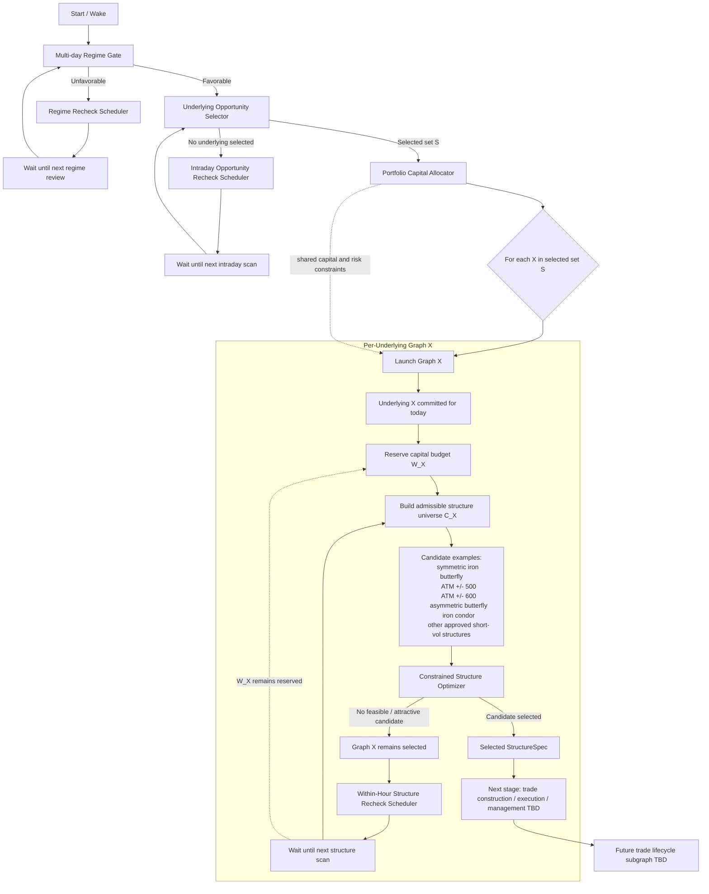

# Autonomous Butterfly Trading Workflow — Preliminary Graph v0.3

This is the living master decision graph for the autonomous Volarb butterfly trading system.

It is intentionally preliminary. Nodes marked **TBD** are architectural placeholders that will be designed independently as the workflow develops.

## Master decision graph



## Current interpretation

The master graph currently has three different waiting loops:

1. **Multi-day regime loop**  
   Used when the broader short-gamma environment is unfavorable.

2. **Intraday opportunity loop**  
   Used when the broader regime is favorable but none of NIFTY, BANKNIFTY, or SENSEX is currently selected.

3. **Within-hour structure loop**  
   Used when an underlying X has already been selected, but Graph X cannot currently find an acceptable candidate structure. Graph X remains active and retries its candidate search on a faster, within-hour schedule.

When the underlying selector returns a non-empty set (S), the portfolio layer allocates capital to each selected underlying. Each selected underlying then receives its own independent graph.

For a selected underlying (X):

- the graph receives a capital budget (W_X);
- an admissible candidate universe (C_X) is constructed;
- a constrained optimizer selects the best candidate that satisfies the capital/margin budget and other future admissibility constraints;
- the optimizer is allowed to return no feasible candidate;
- the selected output is a broker-neutral `StructureSpec`, not a broker order.

## Current graph hierarchy

```text
MASTER GRAPH
|
|-- Multi-day Regime Gate
|   |-- unfavorable -> Regime Recheck Scheduler -> back to Regime Gate
|   |
|   +-- favorable
|        |
|        +-- Underlying Opportunity Selector
|             |
|             |-- empty set -> Intraday Opportunity Recheck -> selector again
|             |
|             +-- selected set S
|                  |
|                  +-- Portfolio Capital Allocator
- Daily underlying commitment revocation / expiry rules
|                       |
|                       +-- Graph NIFTY      if selected
|                       +-- Graph BANKNIFTY  if selected
|                       +-- Graph SENSEX     if selected
|
+-- PER-UNDERLYING GRAPH X
     |
     +-- commit underlying X for the day
     +-- reserve W_X
     +-- build candidate set C_X
     +-- constrained optimizer
          |
          |-- no candidate -> Within-Hour Structure Recheck Scheduler -> candidate search again
          |
          +-- selected StructureSpec
               |
               +-- execution / management lifecycle TBD
```

## Design rules already established

- Dhan is an infrastructure provider, not part of the core architecture.
- Research data, decision-time market data, and execution are separate provider interfaces.
- The regime gate is multi-day, not intraday.
- Underlying selection is distinct from structure selection.
- Capital is allocated to an underlying graph before its structure optimizer runs.
- Once an underlying is selected for the day, its capital W_X remains reserved until an explicit higher-level revocation or end-of-day expiry.
- NIFTY, BANKNIFTY, and SENSEX graphs may run concurrently.
- Shared account capital cannot be double-counted by parallel graphs.
- A favorable regime does not force a trade.
- A selected underlying does not force a structure.
- An optimizer may return **NO FEASIBLE CANDIDATE**.
- A no-candidate result does not revoke the underlying decision; Graph X remains active and rechecks within the hour.
- Waiting for a structure does not release W_X to another graph.
- Broker execution remains downstream of the broker-neutral decision graph.

## Scheduling hierarchy

```text
DAYS / WEEKS
Regime unfavorable
    -> Regime Recheck Scheduler
    -> Regime Gate

INTRADAY
Regime favorable, no underlying selected
    -> Intraday Opportunity Recheck Scheduler
    -> Underlying Opportunity Selector

WITHIN THE HOUR
Underlying X selected, no acceptable C_X candidate
    -> Within-Hour Structure Recheck Scheduler
    -> refresh candidate set / optimizer
```

## Next expansion points

The graph is expected to expand primarily at these nodes:

- Regime Gate
- Regime Recheck Scheduler
- Underlying Opportunity Selector
- Intraday Opportunity Recheck Scheduler
- Portfolio Capital Allocator
- Per-underlying Structure Optimizer
- Within-Hour Structure Recheck Scheduler
- Trade construction
- Order execution
- Position monitoring
- Hold / recenter / hedge / reduce / exit decisions
- Portfolio risk coordination
- Post-trade learning and research feedback

