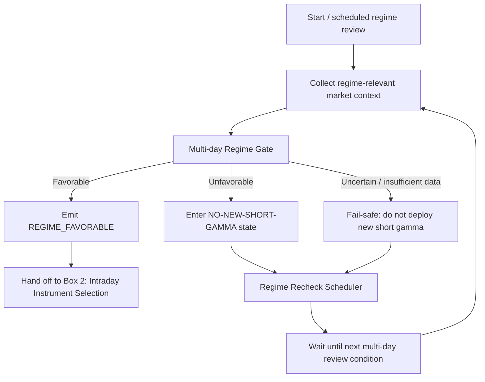

# Box 1 — Regime Decision Graph

This graph owns the **days/weeks decision horizon**.

Its only job is to decide whether the broader market environment currently permits short-gamma deployment. It does not choose NIFTY, BANKNIFTY, SENSEX, strikes, structures, or execution tactics.

## Graph



## Established decisions

- This is a **persistent multi-day / multi-week regime**, not an intraday regime.
- A favorable regime means short gamma may be considered; it does **not** force a trade.
- An unfavorable or uncertain regime prohibits new short-gamma deployment.
- The Regime Recheck Scheduler decides when enough new information may have accumulated to revisit the regime.
- The recheck may eventually be time-based, event/state-change based, or hybrid; methodology remains TBD.
- Box 2 is entered only after Box 1 emits `REGIME_FAVORABLE`.

## Output contract

At minimum:

```text
RegimeDecision
  state = FAVORABLE | UNFAVORABLE | UNCERTAIN
  assessed_at = ...
  valid_until / next_review_condition = ...
  reasons = ...          # future
  confidence = ...       # future, optional
```

## Still TBD

- exact regime model and variables;
- calibration and validation;
- precise recheck rule;
- what can invalidate a favorable regime before its scheduled review;
- whether the regime is market-wide or later gains underlying/expiry-specific overlays.
