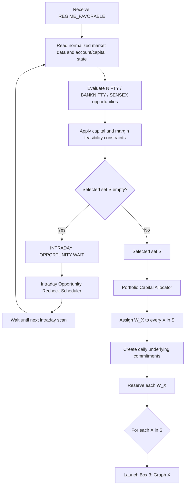

# Box 2 — Intraday Instrument Selection & Capital Allocation Graph

This graph owns the **intraday portfolio-selection horizon** after Box 1 has already declared the broader regime favorable.

Its job is to decide which underlyings should be committed for the day from:

- NIFTY
- BANKNIFTY
- SENSEX

and to allocate a capital budget `W_X` to each selected underlying.

## Graph



## Established decisions

- Box 2 is reached only when the multi-day regime is favorable.
- The selector may output any subset of `{NIFTY, BANKNIFTY, SENSEX}`, including all three or none.
- Capital can shrink the feasible instrument universe.
- If the selected set is empty, the system stays intraday and asks **when to scan the three underlyings again**. It does not return to the multi-day regime loop unless Box 1 itself becomes due/invalidated.
- Once X is selected for the day, that selection becomes a durable **daily commitment**.
- Once X is selected, `W_X` is reserved for Graph X.
- Reserved `W_X` is not opportunistically consumed by another graph merely because X has not yet found a structure.
- NIFTY, BANKNIFTY, and SENSEX graphs may run concurrently.
- Shared account capital must not be double-counted.

## Outputs

For a non-empty selection:

```text
DailySelection
  selected_set S = {X1, X2, ...}

For each X in S:
  DailyUnderlyingCommitment
    underlying = X
    capital_budget = W_X
    state = SELECTED_AND_RESERVED
```

Each `DailyUnderlyingCommitment` launches one independent Box 3 graph.

## Still TBD

- how attractiveness is compared across the three underlyings;
- the objective/rule used to allocate total deployable capital into `W_X`;
- exact intraday recheck cadence;
- what explicitly revokes a daily underlying commitment before market close;
- whether commitments automatically expire at end of session;
- how a favorable regime is force-invalidated by an exceptional event.
