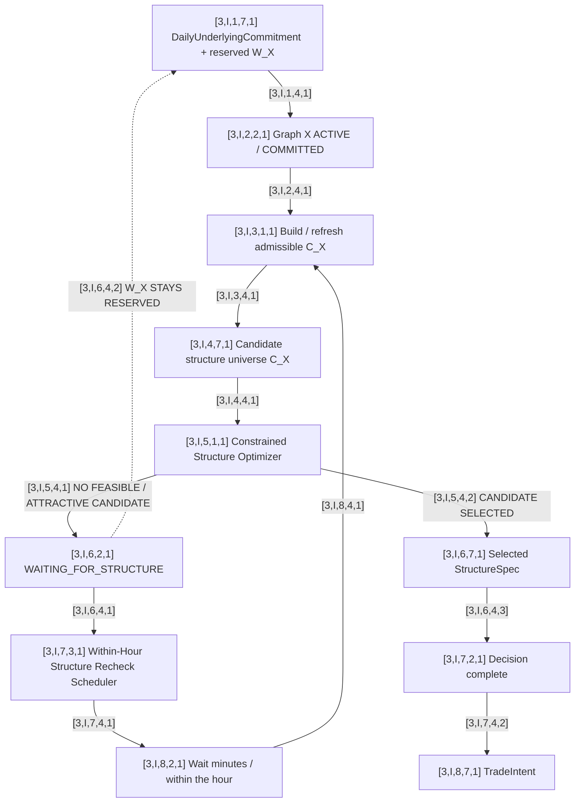

# [3,0,0,0,0] Box 3 — Per-Underlying Trade Selection Graph X

This is a parameterized graph. The canonical template uses `I=0`.

Runtime graph instance convention:

```text
I=1 NIFTY
I=2 BANKNIFTY
I=3 SENSEX
```

Every local ID below keeps the same coordinates and replaces `I` with the active instance.

## Graph



`[3,I,4,7,1] C_X` may contain symmetric butterflies such as ATM ±500 / ±600, asymmetric butterflies, iron condors, and other approved short-vol structures.

## Optimization concept

```text
Candidate universe: C_X
Reserved capital: W_X

Choose c* in C_X

subject to:
  required_capital(c*) <= W_X
  c* passes all admissibility constraints

maximize:
  Objective_X(c)
```

The exact objective remains TBD.

## Established decisions

- Selecting X does not predetermine the structure.
- Candidate structures are extensible.
- The optimizer is constrained by the capital allocated to this graph.
- The optimizer may return no feasible/attractive candidate.
- No candidate does not revoke the decision to trade X.
- `[3,I,7,3,1]` rechecks on a within-hour horizon.
- `W_X` remains reserved while the graph waits.
- Other selected-underlying instances may proceed independently.
- `[3,I,6,7,1] StructureSpec` is broker-neutral.
- Once the StructureSpec is selected, trade selection is complete and `[3,I,8,7,1] TradeIntent` goes to Box 4.

## Example StructureSpec

```text
[3,I,6,7,1] StructureSpec
  underlying = X
  family = IRON_BUTTERFLY
  expiry = ...
  short_strike = ...
  put_wing = ...
  call_wing = ...
  lots = ...
```

## Still TBD

- candidate catalogue and parameter ranges;
- expiry-selection logic;
- optimizer objective;
- hard constraints besides capital/margin;
- whether multiple structures can be selected for one underlying;
- exact within-hour scheduling rule;
- event that can revoke the daily commitment.
