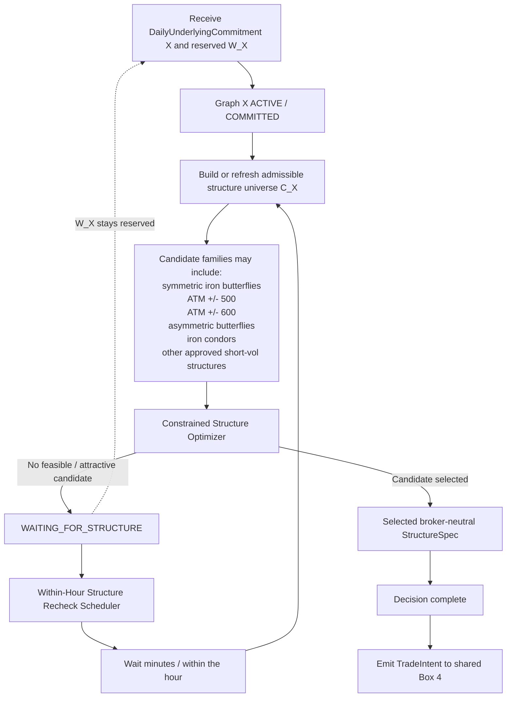

# Box 3 — Per-Underlying Trade Selection Graph X

This is a **parameterized graph** instantiated independently for every selected underlying `X`.

Examples:

- Graph NIFTY
- Graph BANKNIFTY
- Graph SENSEX

If Box 2 selects two underlyings, two Box 3 instances run independently. If it selects all three, all three run.

The higher-level decision that X should be traded today has already been made before this graph starts.

## Graph



## Optimization concept

For underlying `X`:

```text
Candidate universe: C_X
Reserved capital: W_X

Choose c* in C_X

subject to:
  required_capital(c*) <= W_X
  c* passes all admissibility constraints

maximize:
  Objective_X(c)
```

The exact objective remains TBD.

## Established decisions

- Selecting X does **not** predetermine the structure.
- Candidate structures are extensible and not hard-coded to a single butterfly width.
- The optimizer is constrained by the capital allocated to this graph.
- The optimizer may return **NO FEASIBLE / ATTRACTIVE CANDIDATE**.
- Failure to find a candidate does **not** revoke the decision to trade X.
- If no candidate is found, Graph X stays active and retries on a **within-hour** timescale.
- `W_X` remains reserved while Graph X waits.
- Another selected underlying may proceed independently while Graph X waits.
- Once a `StructureSpec` is selected, the trade-selection decision is complete and the graph emits a `TradeIntent` to Box 4.
- The output is broker-neutral. It is not a Dhan order.

## Example StructureSpec

```text
StructureSpec
  underlying = NIFTY
  family = IRON_BUTTERFLY
  expiry = ...
  short_strike = ...
  put_wing = ...
  call_wing = ...
  lots = ...
```

## Still TBD

- exact candidate catalogue and parameter ranges;
- expiry-selection logic;
- optimizer objective;
- hard constraints besides capital/margin;
- whether more than one structure can be chosen for the same underlying;
- exact within-hour scheduling rule;
- what event can revoke the higher-level daily commitment while this graph is active.
