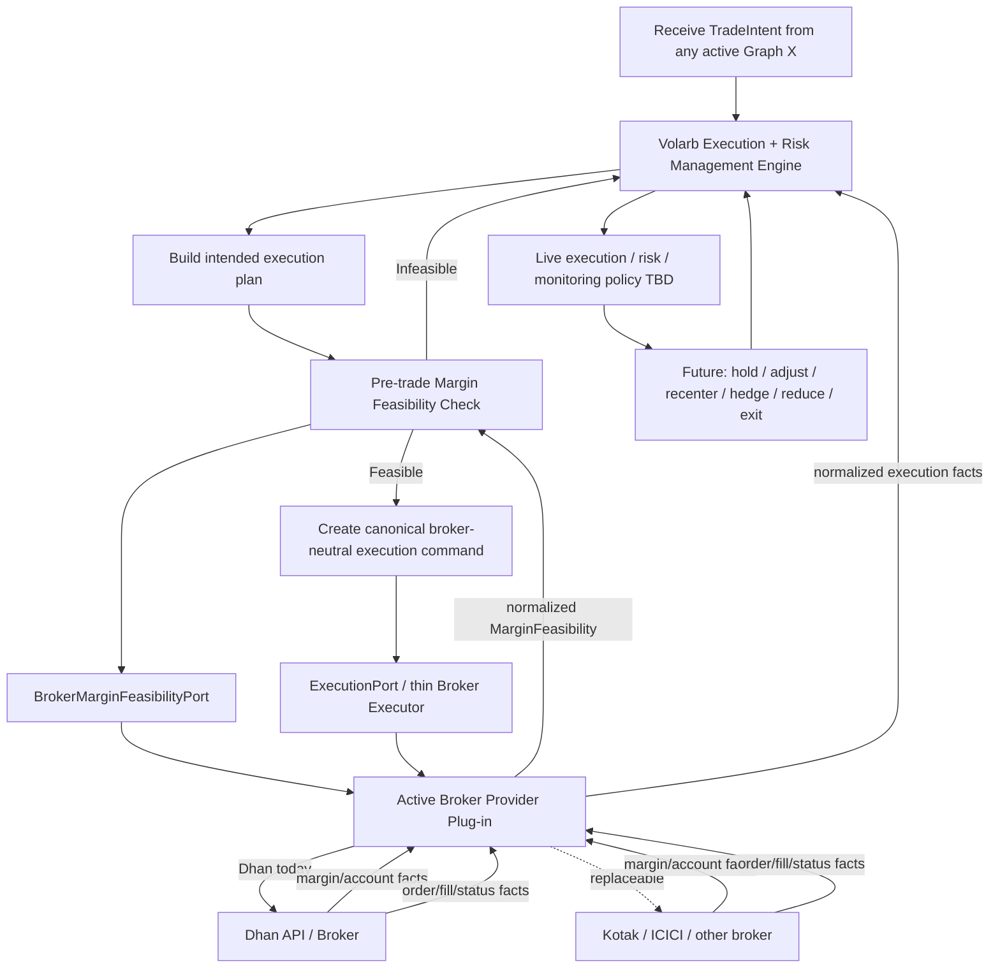

# Box 4 — Shared Execution & Risk Management Graph

This graph is **shared across the selected underlyings for the trading day**.

Box 3 instances decide **what should be traded** and emit broker-neutral `TradeIntent` objects. Box 4 owns the intelligent decisions about **how to establish, monitor, manage, modify, and close those positions in the real market**.

The internal execution/risk policy is intentionally still preliminary.

## Graph



## Architectural split

### Volarb Execution + Risk Management Engine

This is the **intelligent** layer.

It will eventually own:

- execution sequencing and tactics;
- responses to fills and partial fills;
- live position monitoring;
- risk decisions;
- hold / recenter / hedge / reduce / exit logic;
- coordination across positions/underlyings for the day.

### Broker Provider Plug-in

This is intentionally thin.

Its responsibilities include:

- translating canonical commands into broker-specific API calls;
- authentication;
- instrument/token mapping;
- IP whitelisting and broker-specific connectivity;
- order IDs and status synchronization;
- broker/API errors;
- returning authoritative fills, positions, account state, and margin facts.

It must **not** independently choose strikes, change the structure, resize because it prefers another size, recenter, or alter strategy logic.

## Margin dependency

Broker-independence does not mean broker-blindness.

Before sending an execution command, Volarb must query the active broker through a broker-neutral:

`BrokerMarginFeasibilityPort`

Provider-specific implementations may include:

- `DhanMarginFeasibilityAdapter`
- `KotakMarginFeasibilityAdapter`
- `ICICIMarginFeasibilityAdapter`

Conceptually:

```text
MarginFeasibility
  feasible: true / false
  required_margin: ...
  available_margin: ...
  margin_shortfall: ...
  broker: ...
  checked_at: ...
  raw_reference: ...
```

If the intended execution is infeasible, the broker does not improvise. Control returns to the intelligent Volarb engine for a new strategy/execution decision.

## Provider-independence rule

The same Box 4 intelligence should work if Dhan is replaced by Kotak, ICICI Securities, or another broker.

The broker provides authoritative facts and execution transport. **Volarb provides the intelligence.**

## Still TBD

- internal execution-policy graph;
- canonical `TradeIntent` schema;
- canonical execution command/event schemas;
- behavior after a margin-infeasible result;
- which failures the adapter handles internally versus escalates;
- fill/partial-fill policy;
- position monitoring;
- risk thresholds;
- hold / recenter / hedge / reduce / exit logic;
- coordination across multiple live Graph X positions.
