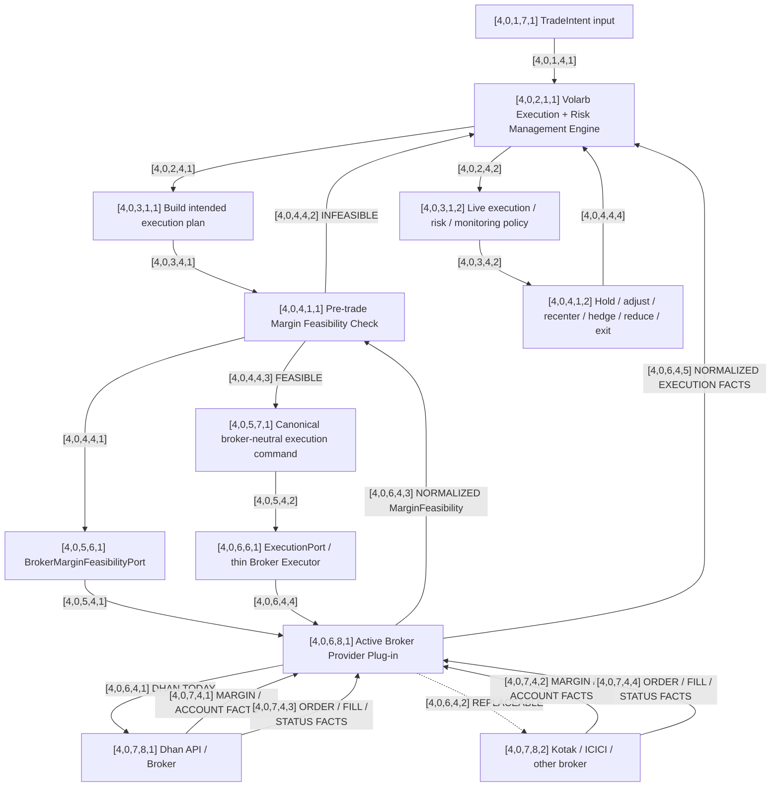

# [4,0,0,0,0] Box 4 — Shared Execution & Risk Management Graph

This graph is shared across all selected underlyings for the trading day.

Box 3 decides **what should be traded**. Box 4 owns the intelligent decisions about **how to establish, monitor, manage, modify, and close positions**.

## Graph



## Architectural split

### [4,0,2,1,1] Volarb Execution + Risk Management Engine

This is the intelligent layer. It will own execution sequencing, responses to fills and partial fills, live position monitoring, risk decisions, adjustment/exit logic, and coordination across positions.

### [4,0,6,8,1] Broker Provider Plug-in

This is intentionally thin. It translates canonical commands, handles authentication, instrument/token mapping, IP whitelisting, order IDs, broker errors, and returns authoritative execution/account facts.

It must not independently choose strikes, alter structures, resize because it prefers another size, recenter, or alter strategy logic.

## Broker margin dependency

Broker-independence does not mean broker-blindness.

Before execution, Volarb queries `[4,0,5,6,1] BrokerMarginFeasibilityPort`.

Provider-specific implementations may include Dhan, Kotak, ICICI Securities, or another broker adapter.

Conceptual normalized result:

```text
MarginFeasibility
  feasible: true / false
  required_margin: ...
  available_margin: ...
  margin_shortfall: ...
  broker: ...
  checked_at: ...
  raw_reference: ...
```

If infeasible, control returns to `[4,0,2,1,1]`. The broker does not improvise.

## Provider-independence rule

The broker supplies authoritative facts and execution transport. **Volarb supplies the intelligence.**

## Still TBD

- internal execution-policy graph;
- canonical TradeIntent schema;
- canonical execution command/event schemas;
- behavior after margin infeasibility;
- adapter-local versus escalated failures;
- fill/partial-fill policy;
- position monitoring;
- risk thresholds;
- hold / recenter / hedge / reduce / exit logic;
- coordination across multiple live Box 3 positions.
