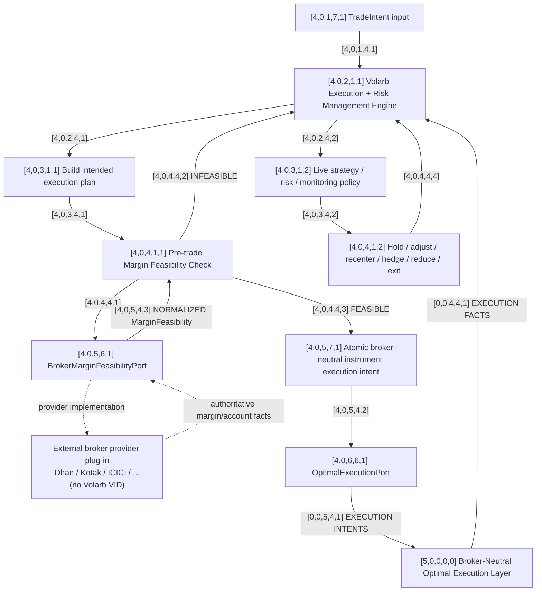

# [4,0,0,0,0] Box 4 — Shared Execution & Risk Management Graph

This graph is shared across all selected underlyings for the trading day.

Box 3 decides **what should be traded**. Box 4 owns the strategy/risk intelligence about **what economic instrument actions are required** to establish, monitor, modify, hedge, recenter, reduce, or close positions.

Box 4 does **not** own the reusable broker-neutral optimal-execution algorithm. That responsibility now belongs to Box 5.

## Graph



External provider plug-ins are deliberately shown without VIDs. The Volarb-owned interfaces have VIDs; concrete broker implementations do not.

## Architectural split

### [4,0,2,1,1] Volarb Execution + Risk Management Engine

This is the strategy/risk intelligence layer.

It decides the desired economic actions: which exact instruments should be bought or sold, in what target quantity, because of entry, hold, adjustment, recentering, hedging, risk reduction, or exit decisions.

It does not need to decide the broker-specific mechanics of achieving those executions optimally.

### [4,0,5,7,1] Atomic broker-neutral instrument execution intent

The atomic unit leaving Box 4 is one desired instrument action.

A butterfly can therefore generate four separate instances of this contract at the same time. The contract does not need to identify them as butterfly legs.

Conceptually:

```text
side
economic instrument identity
quantity
[future execution constraints still TBD]
```

The economic identity is broker-neutral. Dhan Security IDs, Kotak identifiers, exchange-specific payload fields, and similar provider vocabulary do not cross this boundary.

### [4,0,6,6,1] OptimalExecutionPort

This is the handoff from strategy/risk management into Box 5.

Box 4 can hand Box 5 one or more atomic instrument execution intentions. Box 5 registers them and applies the reusable optimal-execution algorithm.

The previous interpretation of this interface as a thin broker executor is superseded.

## Broker margin dependency

Broker-independence does not mean broker-blindness.

Before execution, Volarb queries `[4,0,5,6,1] BrokerMarginFeasibilityPort`.

The port is implemented through the active external broker provider and returns normalized authoritative margin/account facts. The concrete provider implementation is outside the Volarb VID namespace.

Conceptual normalized result:

```text
MarginFeasibility
  feasible: true / false
  required_margin: ...
  available_margin: ...
  margin_shortfall: ...
  broker: ...
  checked_at: ...
  raw_reference: ...
```

If infeasible, control returns to `[4,0,2,1,1]`. Neither Box 5 nor the broker plug-in invents an alternative strategy.

## Responsibility boundary

**Box 4:** what economic action is required.

**Box 5:** how the current set of desired instrument executions should be executed optimally.

**Broker plug-in:** broker-specific translation, transport, and authoritative facts.

Replacing Dhan should not require rebuilding Box 5.

## Still TBD

- exact atomic execution-intent schema;
- quantity representation;
- execution constraints Box 4 may attach;
- internal optimal-execution objective and algorithm;
- sequencing across several simultaneous registry entries;
- fill/partial-fill response policy;
- pricing and repricing logic;
- modification versus cancel/replace logic;
- interaction between execution progress and Box 4 risk decisions;
- behavior after margin infeasibility;
- portfolio coordination across multiple live positions.
