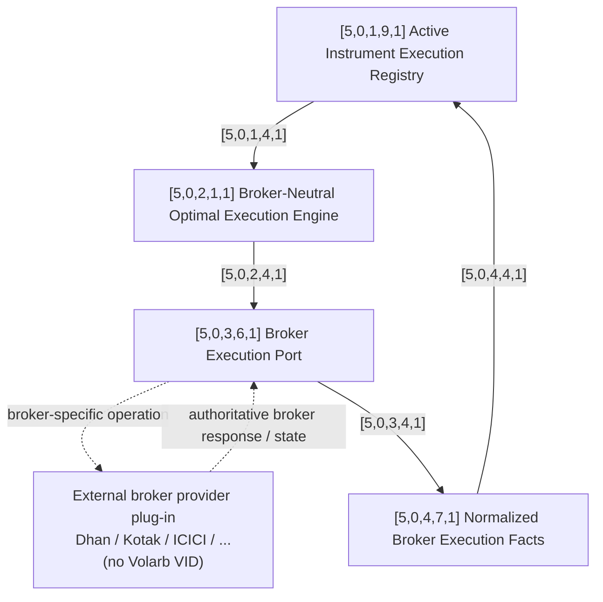

# [5,0,0,0,0] Box 5 — Broker-Neutral Optimal Execution Layer

## Purpose

Box 5 is Volarb's reusable **optimal execution layer**.

It receives already-decided, broker-neutral instrument execution intentions from Box 4, maintains the current execution registry, and determines how the registered instructions should be executed optimally.

It is **not Dhan-specific**.

A migration from Dhan to Kotak, ICICI Securities, or another broker should replace the provider plug-in rather than require a new optimal-execution engine.

## Core principle

Box 5 does not need to know whether an order belongs to a butterfly, caterpillar, mouse, hedge, recenter, exit, or another strategy.

It sees instrument-level execution work.

For example, Box 4 may concurrently hand down four intents that happen to be the four legs of a butterfly. Box 5 sees four registry entries requiring execution.

```text
BOX 4
strategy/risk meaning
        |
        | one or more atomic instrument execution intents
        v
+--------------------------------------------------+
| [5,0,0,0,0] BROKER-NEUTRAL OPTIMAL EXECUTION   |
|                                                  |
| [5,0,1,9,1] Active Instrument Execution Registry|
|                    |                             |
|                    v                             |
| [5,0,2,1,1] Optimal Execution Engine            |
|                    |                             |
|                    v                             |
| [5,0,3,6,1] Broker Execution Port               |
|                    |                             |
|                    v                             |
| [5,0,4,7,1] Normalized Broker Execution Facts   |
+--------------------------------------------------+
                     |
                     v
       external broker provider plug-in
        Dhan / Kotak / ICICI / ...
              (no Volarb VID)
```

## Minimal graph fixed so far



The external plug-in boundary itself is not a numbered Volarb architectural object.

## [5,0,1,9,1] Active Instrument Execution Registry

At any moment Box 5 maintains the set of instrument executions currently required or in progress.

A strategy may generate one entry or many entries simultaneously.

Example:

```text
registry
  - BUY  instrument A  ...
  - SELL instrument B  ...
  - BUY  instrument C  ...
  - SELL instrument D  ...
```

Box 5 does not need the higher-level statement "A/B/C/D form a butterfly."

The exact registry schema, states, priorities, constraints, timestamps, dependencies and lifecycle fields remain TBD.

## [5,0,2,1,1] Broker-Neutral Optimal Execution Engine

This is the reusable execution algorithm.

Its job is to inspect the current registry and determine how to execute the outstanding instrument intentions optimally.

The word **optimal** is intentional, but its objective function and algorithm are not yet defined.

We have not yet decided:
- how it prioritizes simultaneous entries;
- whether it sequences, parallelizes, or groups orders;
- how it reacts to fills and partial fills;
- how it sets or changes prices;
- how it handles urgency;
- how it handles liquidity and spread;
- how it balances execution quality against exposure while legs are incomplete.

Those decisions will be designed bottom-up.

## [5,0,3,6,1] Broker Execution Port

The optimal execution engine does not call Dhan-specific APIs.

It sends generic broker operations through this port.

Conceptually these may later include operations such as:
- place;
- modify;
- cancel;
- query order;
- query fills;
- query positions;
- query account/broker state.

The exact port contract remains TBD.

## External broker provider plug-ins — no Volarb VID

Concrete broker implementations sit beneath the Broker Execution Port.

Examples:

```text
provider = dhan
provider = kotak
provider = icici
```

They do not receive Box numbers or Volarb VIDs.

Their responsibility is deliberately mechanical:
- resolve broker-specific instrument identifiers;
- translate canonical operations into broker payloads;
- authenticate;
- satisfy broker-specific connectivity/security requirements;
- place/modify/cancel/query through the broker API;
- return authoritative broker facts;
- surface provider-specific failures in normalized form.

They do **not** own the reusable optimal-execution algorithm.

## Dhan implementation

The existing `services/dhan-chatgpt-mcp/` code is the current Dhan substrate.

Reusable provider-specific pieces include:
- Dhan authentication/session handling;
- IP-whitelist/readiness checks;
- Dhan instrument-master and Security-ID mapping;
- Dhan API client;
- order/fill/position/funds queries;
- broker margin calls;
- durable correlation/reconciliation primitives;
- broker-specific error handling that can be normalized.

The existing `ButterflyExecutor` also contains execution-policy and optimization behavior. That logic must be classified before reuse. Broker-neutral optimal-execution behavior belongs in Box 5 rather than the Dhan provider merely because the first implementation happened to be written there.

See: [Dhan execution provider notes](../providers/dhan-execution.md).

## [5,0,4,7,1] Normalized Broker Execution Facts

Broker facts returned through the provider are normalized before they are used by Box 5 or returned upstream to Box 4.

The exact event taxonomy is still TBD, but this boundary will eventually represent authoritative facts such as order acknowledgement, pending state, fills, partial fills, rejection, cancellation, ambiguity, and broker/account state.

## Cross-box behavior

Box 4 can send multiple `[4,0,5,7,1]` atomic instrument execution intents into Box 5.

Cross-box edges:

- `[0,0,5,4,1]` Box 4 instrument execution intents -> Box 5 execution registry.
- `[0,0,4,4,1]` Box 5 normalized execution facts -> Box 4 execution/risk engine.

This is a feedback loop. Strategy/risk decisions remain in Box 4 while execution optimization remains in Box 5.

## Provider-replaceability acceptance test

A broker migration should require:
- a new provider implementation beneath `[5,0,3,6,1]`;
- provider configuration/capability mapping;
- broker-specific validation/tests.

It should **not** require rewriting:
- the strategy;
- butterfly construction;
- Box 4 risk logic;
- the Box 5 optimal-execution algorithm merely because the broker changed.

## Still unresolved

Everything inside the actual optimization algorithm beyond the registry/engine/port boundary remains open.

The next design step is to specify how the optimal execution engine should operate on several simultaneous instrument entries.
