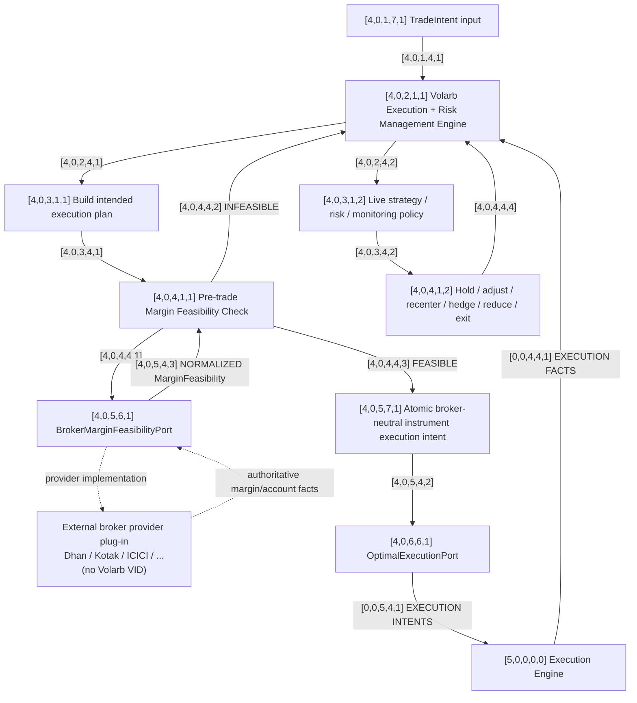

# [4,0,0,0,0] Position Management

Status: **active Volarb strategy design**, not a deployed autonomous workflow. See [workflow ownership](README.md) for the current human-executed controller and governing covenant; design schedulers and broader strategy choices do not authorize orders or monitoring.

This graph is shared across all selected underlyings for the trading day.

Trade Selection decides **what should be traded**. Position Management owns the strategy/risk intelligence about **what economic instrument actions are required** to establish, monitor, modify, hedge, recenter, reduce, or close positions.

Position Management does **not** own the reusable broker-neutral optimal-execution algorithm. That responsibility now belongs to Execution Engine.

## Graph



External provider plug-ins are deliberately shown without VIDs. The Volarb-owned interfaces have VIDs; concrete broker implementations do not.

## Architectural split

### [4,0,2,1,1] Volarb Execution + Risk Management Engine

This is the strategy/risk intelligence layer.

It decides the desired economic actions: which exact instruments should be bought or sold, in what target quantity, because of entry, hold, adjustment, recentering, hedging, risk reduction, or exit decisions.

It does not need to decide the broker-specific mechanics of achieving those executions optimally.

### [4,0,5,7,1] Atomic broker-neutral instrument execution intent

The atomic unit leaving Position Management is one desired instrument action.

A butterfly can therefore generate four separate instances of this contract at the same time. The contract does not need to identify them as butterfly legs.

Conceptually:

```text
side
economic instrument identity
quantity
runtime intent_id / intent_version
execution constraints (schema still to be finalized)
```

The economic identity is broker-neutral. Dhan Security IDs, Kotak identifiers, exchange-specific payload fields, and similar provider vocabulary do not cross this boundary.

### [4,0,6,6,1] OptimalExecutionPort

This is the handoff from Position Management into Execution Engine.

Position Management can hand Execution Engine one or more atomic instrument execution intentions. Execution Engine registers them, applies Margin Optimization, then Execution Slicing and Optimal Execution; every mutation passes through Execution Recovery / Command Commit Guard before the Broker Execution Port.

The previous interpretation of this interface as a thin broker executor is superseded.

## Broker margin dependency

Broker-independence does not mean broker-blindness.

Before execution, Volarb queries `[4,0,5,6,1] BrokerMarginFeasibilityPort`.

The port is implemented through the active external broker provider and returns normalized authoritative margin/account facts. The concrete provider implementation is outside the Volarb VID namespace.

Conceptual normalized result:

```text
MarginFeasibility
  feasible: true / false
  required_margin: ...
  available_margin: ...
  margin_shortfall: ...
  broker: ...
  checked_at: ...
  raw_reference: ...
```

If infeasible, control returns to `[4,0,2,1,1]`. Neither Execution Engine nor the broker plug-in invents an alternative strategy.

## Responsibility boundary

**Position Management:** what economic action is required.

**Execution Engine:** how the current set of desired instrument executions should be executed optimally.

**Broker plug-in:** broker-specific translation, transport, and authoritative facts.

Replacing Dhan should not require rebuilding Execution Engine.

## Design decisions and remaining implementation

The execution policies are specified in the [Execution Engine](execution-engine.md), [Execution Slicing](execution-slicing.md), [Passive Chase](../execution-algorithms/passive-chase.md), [Recovery](execution-recovery.md) and [Interrupt Control](interrupt-control.md) designs. Ordering, one-slice default, partial-fill reconciliation, passive repricing, cancellation/market fallback, intent supersession and guarded mutation are no longer unspecified concepts.

Still open:

- the complete production execution pipeline and durable recovery implementation;
- a finalized strategy-to-engine intent schema, quantity representation and constraint encoding;
- Passive Chase T/N configuration and the margin sequence optimizer implementation;
- strategy policy after margin infeasibility and coordination across multiple live positions;
- the strategy authority that clears an interrupt latch.

Broker request payloads are a separate, implemented boundary described by the [Broker Execution Port call map](../providers/dhan-execution-engine-call-map.md); they do not settle the upstream intent schema.

## Execution interrupts

Position Management may raise an emergency interrupt into Execution Engine when strategy/risk logic determines that normal execution should be preempted.

The current interrupt levels are:

- **L1 CANCEL_WORK** — cancel unfinished orders in the specified scope and suppress further normal execution there.
- **L2 FLATTEN_SCOPE** — immediately flatten a specified affected economic scope using emergency market actions.
- **L3 FLATTEN_ALL** — highest-priority emergency request to flatten all controlled positions immediately.

Position Management supplies the economic scope and intent. Execution Engine's Interrupt Control owns preemption, cancellation/reconciliation, and broker-neutral emergency order transport.

Interrupt Control does not rely on Passive Chase or any other plug-in execution algorithm for emergency flattening.

## Runtime intent versioning

Every instrument-level execution requirement handed to Execution Engine must carry a runtime identity separate from architectural VIDs.

Conceptually:

~~~text
intent_id
intent_version
supersedes_version
created_at
status
~~~

If Position Management changes an outstanding economic requirement, it emits a new version rather than mutating history invisibly.

The new version supersedes older uncompleted work.

Execution Engine must reject stale broker mutations generated under a superseded intent version after reconciling authoritative fills and positions.
