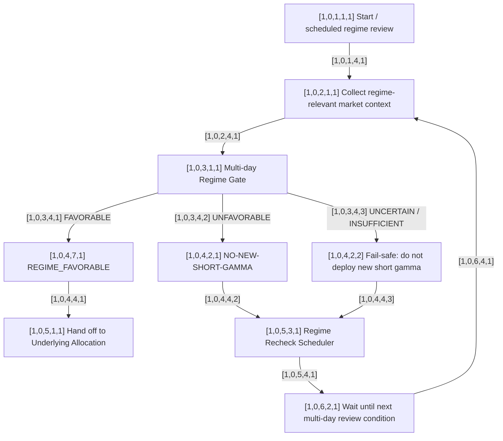

# [1,0,0,0,0] Regime Gate

This graph owns the **days/weeks** decision horizon.

## Graph



## Established decisions

- This is a persistent multi-day / multi-week regime, not an intraday regime.
- A favorable regime permits consideration of short gamma; it does not force a trade.
- Unfavorable or uncertain prohibits new short-gamma deployment.
- `[1,0,5,3,1]` decides when enough new information may justify another regime review.
- Recheck methodology may later be time-based, event/state-change based, or hybrid.
- Underlying Allocation is entered only after `[1,0,4,7,1] REGIME_FAVORABLE`.

## Output contract

```text
[1,0,4,7,1] RegimeDecision / REGIME_FAVORABLE
  state = FAVORABLE | UNFAVORABLE | UNCERTAIN
  assessed_at = ...
  valid_until / next_review_condition = ...
  reasons = ...        # future
  confidence = ...     # future
```

## Still TBD

- exact regime model and variables;
- calibration and validation;
- precise recheck rule;
- what can invalidate a favorable regime before scheduled review;
- whether regime later receives underlying/expiry-specific overlays.
