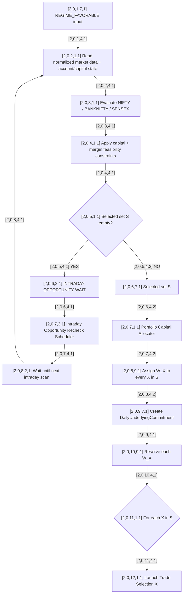

# [2,0,0,0,0] Underlying Allocation

Status: **active Volarb strategy design**, not a deployed autonomous workflow. See [workflow ownership](README.md) for the current human-executed controller and governing covenant; design schedulers and broader strategy choices do not authorize orders or monitoring.

This graph owns the **intraday** portfolio-selection horizon after Regime Gate has emitted a favorable regime.

## Graph



## Established decisions

- Underlying Allocation is reached only when Regime Gate is favorable.
- The selector may output any subset of `{NIFTY, BANKNIFTY, SENSEX}`, including all three or none.
- Capital can shrink the feasible instrument universe.
- An empty set stays in Underlying Allocation and uses `[2,0,7,3,1]`; it does not automatically return to Regime Gate.
- Once X is selected, it becomes a durable daily commitment.
- `W_X` is reserved for Graph X and cannot be opportunistically consumed by another graph while X waits.
- Multiple selected underlyings may run concurrently.
- Shared capital may not be double-counted.

## Outputs

```text
[2,0,6,7,1] DailySelection
  selected_set S = {X1, X2, ...}

[2,0,9,7,1] DailyUnderlyingCommitment
  underlying = X
  capital_budget = W_X
  state = SELECTED_AND_RESERVED
```

## Still TBD

- cross-index attractiveness logic;
- objective/rule for allocating total deployable capital into W_X;
- exact intraday recheck cadence;
- revocation conditions for a daily underlying commitment;
- end-of-session expiry behavior;
- exceptional-event force invalidation.
